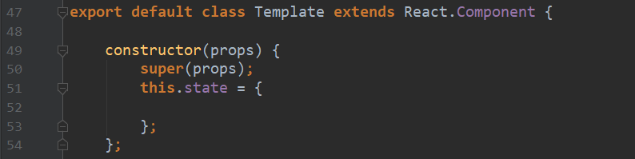

# 理解js中的constructor()

构造函数constructor是用来创建和初始化类中创建的一个对象的特殊方法。

# 在React class中的constructor()
在React class中，总会有一段标准的代码如下图：

想要好好理解其中含义的话，就要先从js的constructor()开始。

## 语法
constructor([arguments]) {...}

一个类中只有一个constructor()。
一个构造方法中可以使用*super*关键字来调用一个父类的构造方法。
如果不指定构造方法，则使用默认构造函数。对于基类，默认构造函数是：
```javascript
constructor() {}
```
对于派生类，默认构造函数是：
 ```javascript
constructor(...args) {
  super(...args);
}
```

## 结合rn代码理解
class Template继承自React.Component,class Template是React.Component的派生类。
React提倡基于组件的设计，所以在coding rn代码时，基本上就是设计组件。
大多数组件在创建时就可以使用各种各样的参数来进行定制，用于定制的参数就称为*props*(属性)。
所以图中class Template的构造方法中接受*props*定制，然后把参数传给父类的构造方法，即：*super(props);*。

至于为什么调用父类的构造方法时，也是使用*super(props);*而不是*super();*,官方文档给出解释:
Class components should always call the base constructor with props.
组件类总是应该使用props调用基础构造函数。

疑惑2：为什么派生类一定要使用*super*来调用父类的构造函数？
以下来自官方文档的说明：
super关键字用于访问和调用一个对象的父对象上的函数。
```javascript
super([arguments]);
```
在构造函数中使用时，*super*关键字将单独出现，并且必须在使用*this*关键字之前使用。
即理解为：
如果不调用super方法，子类就得不到this对象。如：*this.props*。

大部分问题和结论都是基于其他博客或者官方文档得出的，加上自己的小小理解。
## 参考自
[MDN web docs](https://developer.mozilla.org/zh-CN/docs/Web/JavaScript/Reference/Classes/constructor)<br>
[CSDN Blog](https://blog.csdn.net/gx15366039985/article/details/53447098)<br>
[stackoverflow](https://stackoverflow.com/questions/30571875/whats-the-difference-between-super-and-superprops-in-react-when-using-e)<br>

